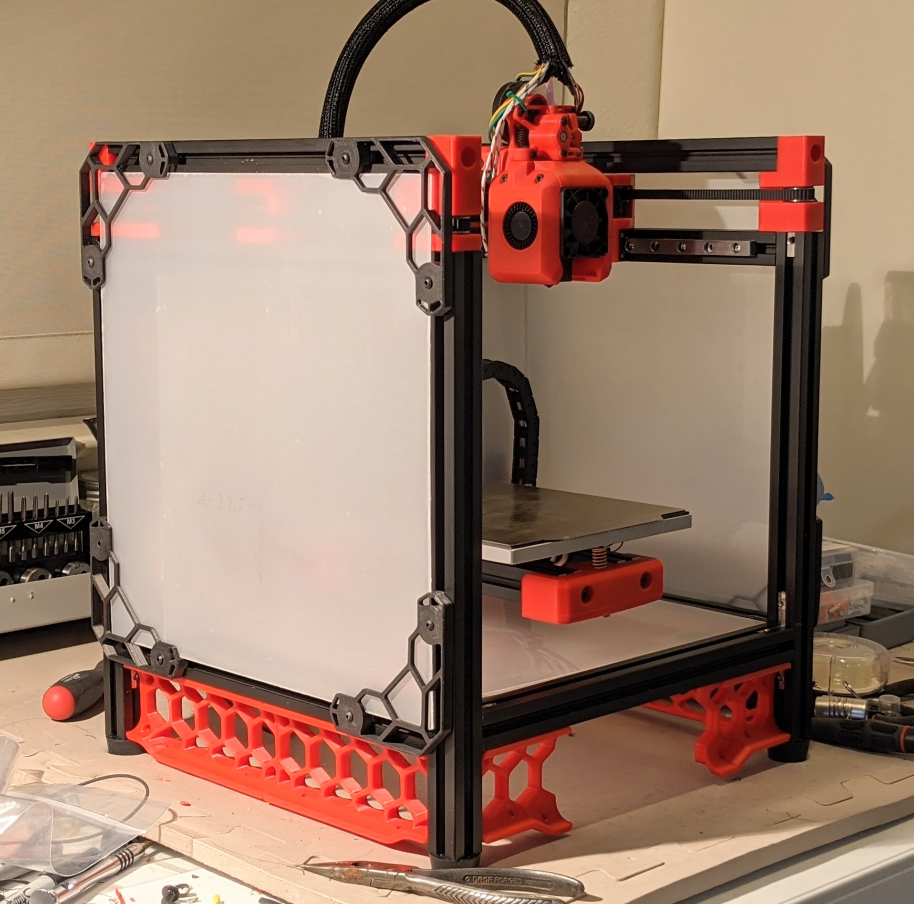

# tiny-m-build
- [tiny-m-build](#tiny-m-build)
  * [WORK IN PROGRESS](#work-in-progress)
  * [Power](#power)
  * [My preliminary BOM](#my-preliminary-bom)
  * [Build Platform + Plate Information](#build-platform---plate-information)
  * [Stepper Motor Light Reading](#stepper-motor-light-reading)
  * [Frame Assembly](#frame-assembly)
  * [Hinged TopHat](#hinged-tophat)
- [Electronics](#Electronics)
- [Software](#software)
  * [Raspberry Pi Setup](#raspberry-pi-setup)
  * [Fluidd Pi](#fluidd-pi)
  * [Fluidd](#fluidd)
  * [Mainsail OS](#mainsail-os)
  * [Klipper onto SKR Mini E3 V2](#klipper-onto-skr-mini-e3-v2)
    * [Flashing MCU](#Flashing MCU)
    * [Klipper Configuration](#Klipper Configuration)
  * [Wiring](#wiring)
  
### Klipper Configuration
  
- [Assembly](#assembly)
  * [Rails](#rails)
  * [Rails and Build Plate](#rails-and-build-plate)
- [Extruder](#extruder)
  * [Sherpa Mini](#sherpa-mini)

<small><i><a href='http://ecotrust-canada.github.io/markdown-toc/'>Table of contents generated with markdown-toc</a></i></small>

## WORK IN PROGRESS
This is my particular spin on the Tiny-M build, a variant of the Voron V0 using Mitsumi 2020 Extrusions and Nema 17 motors.  The Voron machines are home build high performance printers. With the V0 being the smallest of the series. The numbering scheme, V0, V1, V2 represent different machines, so don't get confused that's it's a revision.

My version of this is slightly different than the online CAD image. I want to used a BTT SKR mini E3 V2, a 24v heated bed (instead of 120v ac) and a direct drive sherpa mini instead of the regular boden drive.

see the cad image at 
https://github.com/gsl12/Tiny-M

I've finished most of the build.  Working on the door and will start the folding top hat soon.


Many more build pictures at https://photos.app.goo.gl/qUpFSqQ5FszeDbXW6

The first things I'll link are the Voron V0 build and the Tiny-M repo.
I'd like to use a small direct hot end instead of the standard Voron V0 Boden so that it will easily print flexable material.
In addition, I really like the two position hinged TopHat by hartk1213

First off, there is a very active Discord channel for VoronDesign. The users are really helpful and friendly which for a home build
3d printer is a huge win.

Voron V0 - https://vorondesign.com/voron0

Tiny-M https://github.com/gsl12/Tiny-M

Sherpa Mini-Extruder https://github.com/Annex-Engineering/Sherpa_Mini-Extruder

Hinged Top Hat - https://github.com/gsl12/Tiny-M/tree/master/STLs/usermods/2020_Hinged_TopHat_Print

Motion controller - BIGTREETECH SKR Mini E3 V2.0 New Upgrade Control Board 32Bit with TMC2209 

Job control - Raspberry Pi Zero W, Pi 3 or 4?

T8x4 ptfe coated Lead Screw + POM - 215mm	 *Note: will have to cut to length as this isn't standard.

Many images so far from Xile on Voron group on discord

## Power
Want to use an external 24v supply and then all 24v on the Tiny-M. This means a 24v heated bed which is normally 120v ac. It removed all 120ac from the underside of the build making it a bit safer. Sourcing the bed heater is harder though as is the connection of the power to the chassis.

WORK IN PROGRESS: Finally ordered the DC power but Xmas will delay shipment. Don't really want to manufacture a board just for me unless I really have to......

External Mean Well 220 watt 24v DC power supply https://www.digikey.com/en/products/detail/GST220A24-R7B/1866-2085-ND/7703643?itemSeq=348860603 \
Power inlet to match - https://www.digikey.com/en/products/detail/KPJX-PM-4S/2092-KPJX-PM-4S-ND/9990081?itemSeq=348766398 \
Power switch - https://www.digikey.com/en/products/detail/RB141C1000-135/EG5684-ND/8540808?itemSeq=348859736

While I really like the idea of 24v of external power with a distribution via this nifty board, I didn't want to have to manufacture a 4 layer board just for my power input, so I decided to go with the simpler solution above....
https://github.com/JNP-1/VoronUsers/tree/master/printer_mods/JNP/PCBs/Supply_PCB

BOM https://github.com/JNP-1/VoronUsers/blob/master/printer_mods/JNP/PCBs/Supply_PCB/BOM/BOM_Supply_PCB_V1.0.txt

Along with an external power brick with a microfit connection\
https://www.digikey.com/en/products/detail/VES220PS24/1470-VES220PS24-ND/10440644?itemSeq=347136397

Use the following when determining how much power a guage of wire can handle https://www.engineeringtoolbox.com/wire-gauges-d_419.html

## My preliminary BOM
https://docs.google.com/spreadsheets/d/1UV62ADl2gtK5vL0fV1nwevR6O9Ppzs0MBe7jnsI-jo4/edit?usp=sharing

## Build Platform + Plate Information
The build plate should be either ATP-5 or MIC6 Cast Aluminum 6" x 6" x 1/4" which is about 150mm x 150mm x 6mm onto which a magnetic layer is added, topped with a spring steel build plate.

The heater for the bed should be aprox 0.4 watts/cm^2.  So 15cm x 15cm = 255cm^2    255 * 0.4 = 102 watts. Less power will heat slower, more might be ok, but don't go crazy.  See the following for great info https://duet3d.dozuki.com/Wiki/Choosing_a_bed_heater


## Stepper Motor Light Reading
Many Nema 17 will fit into the space. 
https://duet3d.dozuki.com/Wiki/Choosing_and_connecting_stepper_motors

## Frame Assembly
Depending on if you are drilling + tapping for your rails or using the 90 degree internal connectors (or possibly both!)

If you are drilling (and have a printer) you can make a guide:
See the STL drill template for the holes: 10, 36 and 60

The bottom extrusions have 50mm of space to the bottom of the uprights.
The back is 26mm on the side beams for a total of 26mm + 20mm total (from the back beam).

## Hinged TopHat
I really like the way the hinged TopHat works and the two positions it can stay in
Need to determine the # of Mitsumu 2020 beams to order. There is a 2020 TopHat for V0 that I've patterned the following on
(was at https://github.com/gsl12/Tiny-M/tree/master/STLs/usermods/2020_Hinged_TopHat_Print)

**The following measurements have not been verified in an actual build.**\
Verticals\
Back 2 x 75 mm\
Front 2 x 92 mm

Horizontal\
Front 2 x 260 mm\
Back 1 x 260 mm, 1 x 274 mm

Sides\
Top Right/Left 2 x 260 mm\
Bottom Right/Left 2 x 230 mm

Totals\
2 x 75 mm\
2 x 92 mm\
2 x 230 mm\
5 x 260 mm\
1 x 274 mm

# Electronics

The BTT SRK mini E3 V2 (not the older models) is my choice for this build. In pariticular, it has a beefier Mosfet for driving the heater bed. It has many other fine updates too: 2 fan outputs. a proper ground return for drivers, and better thermistor circuitry (thanks Ocho).

Raspberry Pi 3/4, or Zero W.  Any of these will work with Klipper software as it's got a fairly light overhead.

Display - FYSETC V2.1 Mini 12864 is what I have on hand. The wiring to the SRK mini E3 V2 is a bit weird. There is a board that plugs into the USB on the Pi that then easily connects to the two 10 pin connectors. Alternatives are possible here.

For the steppers, I chose all LDO motors which have a great reputation. The X/Y/Z are all 0.9 degree LDO 17HS19-2004S (which also deviates from the original Tiny-M BOM with 1.8 degree steppers).

Endstops - I am using some D2FC-F-7N that I had on hand from fixing a Logitech trackball mouse. (I have to ream out the mounting hole to fit M2). 

I would like to try sensorless homing since the TMC2209 support this mode but have not gotten to this yet.

Additional, stealth chop makes the motors REALLY quiet, this would be pretty cool to also try.

# Software

Thinking of using Raspberry Pi 2 (or 3) with Fluidd and Klipper on BTT SKR Mini E3 V2
By using Fluidd Pi, install should be relatively easy. 

The Raspberry Pi runs Klipper which spits out G-code for the Mini E3 to drive the stepper motors.
The Raspberry Pi connects to the Mini E3 via the USB cable that comes with the Mini E3.

## Raspberry Pi Setup

While I'm using a Pi 4, I'll be trying out FluiddPi, so this is just to get the rest of you going should you want to do it all yourself and download an Image. I strongly suggest you go the FluiddPi route....

Download the latest Raspberry Pi OS Lite image, mine was a 5.4 from Dec 2, 2020 and use Etcher or something similar to burn an SD card with the image. I happened to use a 32G card on a Raspberry Pi 4, but smaller cards and slower Pi will also work.

https://www.raspberrypi.org/software/operating-systems/ \
https://github.com/vladbabii/raspberry_os_buster_read_only_fs


## Fluidd Pi
FluiddPi - A Pi image with Klipper, Moonraker, Fluidd and Web Camera support pre-installed. - cadriel/FluiddPI
https://github.com/cadriel/FluiddPI

1. Download the latest FluiddPi Image, I used v1.2.2 at https://github.com/cadriel/FluiddPI/releases/download/v1.2.2/fluiddpi-rpi-lite-v1.2.2.zip
2. Flash your SD card with the image (fluiddpi-rpi-lite-v1.2.2.zip in my case), I used BalenaEtcher for OSX.
3. Connect the Pi to your monitor (funky adapter cable needed for HDMI on Pi 4) and keyboard, login: pi  password: raspberry
4. Run "sudo raspi-config" and walk through each menu item. \
4a. I choose wireless options and connected to my home wireless, but you could also go wired via Ethernet.\
4b. Give your Pi a hostname and probably set it to your timezone for ease of looking at your log files.\
4c. Enable SSH so that you can remotely get into your Pi\
4d. Update Pi with various patches\
4e. exit 'raspi-config' \
4f. update/upgrade the Linux system "sudo apt update" and "sudo apt upgrade"
4e. Reboot and prove all the stuff you just did works

Run "ifconfig" and determine your IP address. Note: You might want to get the MAC address and set a static IP address in your DCHPD configuration of your Wireless Router. Use SSH (on OSX/Linux) or PuTTY on Windows and remotely login to your Pi. The command will be similar to "ssh pi@192.168.1.164" but with your IP address.

In addition, if you browse on your network to http://192.168.1.164/fluidd#/configuration you can start configuration of your system

## Fluidd
https://github.com/cadriel/fluidd/blob/develop/docs/README.md


## Mainsail OS
https://github.com/raymondh2/MainsailOS/releases

How to install \
https://www.youtube.com/watch?v=MK0-MDVJG94

How to configure mainsail \
https://meteyou.github.io/mainsail/setup/

Connecting \
https://discord.com/channels/460117602945990666/741806179247980695/768032201362767893

Web Camera for Mainsail https://lazarofilm.gitbook.io/3d-printing/setting-up-your-pi-camera-for-mainsail

## Klipper onto SKR Mini E3 V2

Klipper code needs to run on the Pi and communicate with the MCU. Our MCU is the BTT SKR Mini E3 V2 and the following is how to set it up.

Note pin difference from earlier SKR mini boards. \

https://github.com/VoronDesign/Voron-0/pull/51 for V2 vs V1.x difference \
https://discord.com/channels/460117602945990666/696930677161197640/746051951447375983 \
https://github.com/VoronDesign/Voron-0/blob/master/VORON-0/Manuals/V0_Setup_Guide.pdf

Another example configuration of SKR Mini E3 V2 for klipper \
https://github.com/KevinOConnor/klipper/blob/master/config/generic-bigtreetech-skr-mini-e3-v2.0.cfg

Copy the appropriate file from the configuration directory in this github to /home/pi/klipper_config/printer.cfg (or similar if you have it in a different place.

Example: OSX & Linux
```console
$ scp configuration/printer.skr.mini.e3.v2.cfg pi@192.168.1.164:/home/pi/klipper_config/printer.cfg
```

Use the following as a reference for configuration of Klipper for BTT SKR mini E3 V2 \


Then, on the Pi move to the klipper directory
```console
$ cd klipper
$ make menuconfig
. 
. 
. 
~/klipper $ cp out/klipper.bin ~/firmware.bin
```

### Flashing MCU

1. Now remove the SD card from the SKR mini and copy this file onto it.
2. Place card into MCU and apply 24v power, wait 1 minute and turn power off
3. Remove card, and look at the contents and the "firmware.bin" file should have been renamed to "FIRMWARE.CUR" 
4. The MCU is now up to date and ready to work with Klipper

### Klipper Configuration

First power on the Pi and then the SKR Mini E3 V2 then log into the Pi and run a couple of commands

Issue the following command, then plug in the USB cable and you should see something like:

```console
$ dmesg -w -t
...
cdc_acm 1-1.1:1.0: ttyACM0: USB ACM device 
usb 1-1.1: USB disconnect, device number 5 
usb 1-1.1: new full-speed USB device number 6 using xhci_hcd 
usb 1-1.1: New USB device found, idVendor=1d50, idProduct=614e, bcdDevice= 1.00 
usb 1-1.1: New USB device strings: Mfr=1, Product=2, SerialNumber=3 
usb 1-1.1: Product: stm32f103xe 
usb 1-1.1: Manufacturer: Klipper 
usb 1-1.1: SerialNumber: 35FFDB054246313020791057 
cdc_acm 1-1.1:1.0: ttyACM0: USB ACM device
```

Klipper should now be able to use a mapping that contains the serial number, copy this info into the 'serial' line in the configuration file

```console
$ ls /dev/serial/by-id/
usb-Klipper_stm32f103xe_35FFDB054246313020791057-if00
```

Edit the klipper_config file
```console
$ vi klipper_config/printer.cfg 
```

So now the cfg should contain your printer
```console
$ grep serial klipper_config/printer.cfg 
serial: /dev/serial/by-id/usb-Klipper_stm32f103xe_35FFDB054246313020791057-if00
```

If you don't see the /dev/by/serial section, double check your USB cable and ensure each board is correctly powered on.

For Klipper to run without throwing errors, it expects to see valid information from it's configured thermistors. So wire up the hotend thermistor to PA0.

If you don't have a heated bed (or it's not installed yet), then comment out the "[heater_bed]" section as well as the last 5 lines of the printer.cfg file

Remove the last 5 lines in printer.cfg file\
#*# [heater_bed]\
#*# control = pid\
#*# pid_kp = 37.593\
#*# pid_ki = 1.139\
#*# pid_kd = 310.142\

## Wiring Guide
Follow the V0 guide for steppers, limit switches, hot end, bed heater, bed thermal cutoff switch, etc.

The best set of info for this is the V0 assembly manual which is oddly not on the Voron main site, but only in the GitHub location
https://github.com/VoronDesign/Voron-0/blob/master/VORON-0/Manuals/V0_Setup_Guide.pdf

The Wago wire connectors can make your life a bit easier too.

Basic stepper setup


Back Left Motor B Connects to X\
Back Right Motor A Connects to Y

Direction of X is inverted as well as Y in the configuration file (at least for my wiring).


# Assembly 

## Rails
Watch the video and note that if you use the 90 degree internal corners, you'll only need two holes in the build plate. You'll still have a bunch of tapping though so worth watching. \
https://www.youtube.com/watch?v=2dvbn0rWA60&feature=youtu.be

## Rails and Build Plate
Carefully review the Tiny-M CAD via OnShape 
https://github.com/gsl12/Tiny-M \
While I found OnShape slow to load on my aging 2011 iMac, it did pretty darn good once loaded.

I believe (but have not verified) that assembly of the tiny-m should be very similar to the V0 rails and build plate, so watch the following video:\
https://youtu.be/Il6koDFPf7w

Build Plate - Wago 221 connectors make for very nice connections on the printer. They are not rated for the temperature at the bed, but unless you are running a very hot enclosed build, they should be OK a distance away. I used a couple of these holders mounted to the rails under the build plate. https://www.thingiverse.com/thing:4579456 The Wago 221 snap into place very firmly.


# Extruder

## Sherpa Mini 
From Anin at https://discord.com/channels/641407187004030997/705183604535459871/785714455178248192

Coffee's video shows the correct assembly order for a K series printer where the lower two screws thread into the toolhead. For a standalone sherpa it might be easier to assemble things in this order:\
1. Install all inserts (including 2 in the rear housing) and bearings, clean up the filament path with a 2mm drill bit\
2. Sand/grind shaft (use the printed tool if necessary)\
3. Insert the 50t gear/shaft assy into the bearing\
4. Stack the core housing on top of the rear housing and install the lower two screws\
5. Install the driven BMG filament gear, add a 5x7x0.5mm waher on top of the gear. Loctite the grub screw\
6. Build and install the idler arm assembly\
7. Install the front housing\
8. Make sure everything runs freely\
9. Install the motor and adjust gear meshing until there is only a tiny bit of backlash\
10. Install the tensioner screw assembly\
Note also that the tensioner screw insert can be up to 6mm long

The video reference.\
https://youtu.be/3WogD5IUwAM
https://www.youtube.com/watch?v=3WogD5IUwAM&t=6s

Images of Dragon for Sherpa Mini \
https://github.com/Annex-Engineering/Sherpa_Mini-Extruder/tree/master/Toolheads/Xile_Tiny_M/Dragon%20Toolhead/Images

Wiring: With the LDO pancake motor I did the wiring as follows: Blue-Yellow-Green-Red

**NOTE: There is a small 37mm (or so) boden tube between the Sherpa Mini and the Extruder. On the end that goes into the Sherpa Mini, enlarge the end with a drill bit so that filament feeds do not get stuck. **

